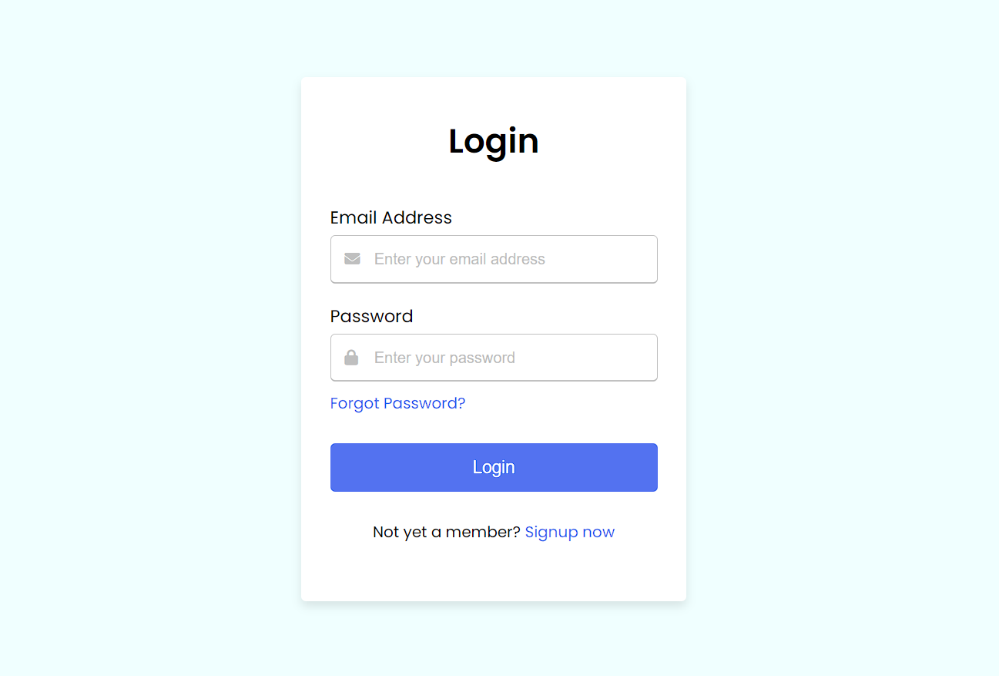
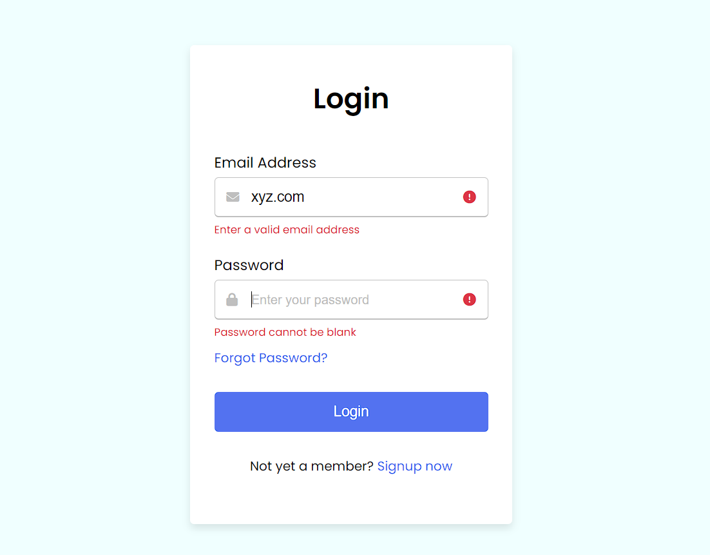

## Login-Form

Simple Login Form with client-side validation using JavaScript which validates if both fields are filled in properly before submission; shows
suitable visual feedback when there is any error.

## Project Specifications

- Login page with email and password fields.
- Responsive design layout that adapts to different screen sizes, including desktop, tablet, and mobile devices.
- Used HTML5 markup tags correctly and semantic elements where possible considering accessibility.

## Demo
[-blue.svg)](https://login-validation-task.netlify.app)

